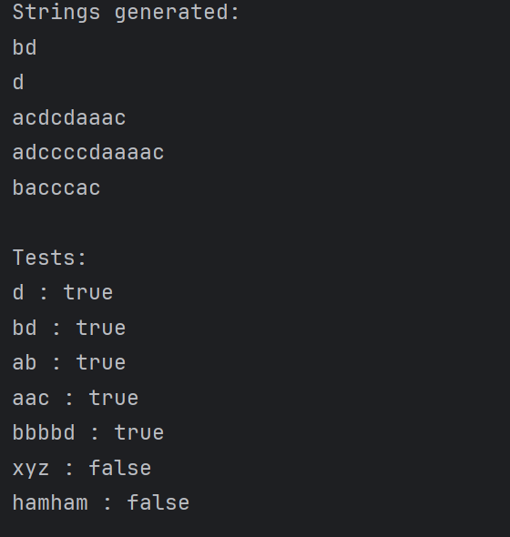

# Laboratory Work 1, Grammars and Finite Automata

### Course: Formal Languages & Finite Automata
### Author: Brînză Vasile
### Group: FAF-242

----

## Theory

In formal language theory, there is a close relationship between grammars and automata. 
A grammar defines a language by generating strings, while an automaton recognizes or accepts strings from a language. 
The conversion from a grammar to a finite automaton enables us to verify whether a given string belongs to the language defined by the grammar.

## Objectives:

* Discover what a language is and what it needs to have to be considered a formal one;
* Provide the initial setup for the evolving project;
* According to the variant number, get the grammar definition and do the following:

  a. Implement a type/class for your grammar;

  b. Add one function that would generate 5 valid strings from the language expressed by your given grammar; 

  c. Implement some functionality that would convert an object of type Grammar to one of type Finite Automaton; 

  d. For the Finite Automaton, please add a method that checks if an input string can be obtained via the state transition from it.

## Implementation description

### Grammar Class:
This class is responsible for storing the data about the symbols that compose the grammar and use them to generate strings or transform to FiniteAutomaton.

##### generateString()

```java
public String generateString() {
  StringBuilder result = new StringBuilder();
  String current = startSymbol;
  Random random = new Random();

  while (true) {
    List<String> rules = productions.get(current);
    String production = rules.get(random.nextInt(rules.size()));

    if (production.length() == 1) {
      result.append(production);
      break;
    } else {
      result.append(production.charAt(0));
      current = String.valueOf(production.charAt(1));
    }
  }

  return result.toString();
}
```

This function generates a valid string from the grammar.

It starts from the startSymbol and repeatedly applies random production rules. At each step, it selects one production for the current non-terminal.

If the production contains only one character, it means a terminal symbol is reached, so the process stops. Otherwise, it appends the terminal part and continues with the next non-terminal.


##### generateFiveStrings()

```java
public List<String> generateFiveStrings() {
    Set<String> results = new HashSet<>();
    while (results.size() < 5) {
        results.add(generateString());
    }
    return new ArrayList<>(results);
}
```

This function generates multiple valid strings.

It repeatedly calls generateString() until it collects 5 unique strings. A Set is used to avoid duplicates, and the result is returned as a list.

##### toFA()

```java
public FiniteAutomation toFA() {

    Set<String> states = new HashSet<>(VN);
    Set<String> finalStates = new HashSet<>();
    Map<String, Map<Character, Set<String>>> transitions = new HashMap<>();

    String finalState = "Qf";
    states.add(finalState);
    finalStates.add(finalState);

    for (String state : states) {
        transitions.put(state, new HashMap<>());
    }

    for (String left : productions.keySet()) {
        for (String production : productions.get(left)) {

            char terminal = production.charAt(0);

            if (production.length() == 1) {
                transitions.get(left)
                        .computeIfAbsent(terminal, k -> new HashSet<>())
                        .add(finalState);
            } else {
                String nextState = String.valueOf(production.charAt(1));
                transitions.get(left)
                        .computeIfAbsent(terminal, k -> new HashSet<>())
                        .add(nextState);
            }
        }
    }
}
```

This function converts the grammar into a finite automaton.

Each non-terminal becomes a state. A special final state (Qf) is added to represent termination.

For every production:

If it is of the form A -> a, a transition is created to the final state.

If it is A -> aB, a transition is created to state B.

The transitions are stored in a structure that allows multiple possible next states, making the automaton nondeterministic.


### Finite Automaton Class:
This class represents the Finite Automaton and it allows checking if a string belongs to a language

##### accepts(String input)

```java
public boolean accepts(String input) {
  Set<String> currentStates = new HashSet<>();
  currentStates.add(startState);

  for (char symbol : input.toCharArray()) {
    Set<String> nextStates = new HashSet<>();

    for (String state : currentStates) {
      if (transitions.get(state).containsKey(symbol)) {
        nextStates.addAll(
                transitions.get(state).get(symbol)
        );
      }
    }

    currentStates = nextStates;
    if (currentStates.isEmpty()) {
      return false;
    }
  }
}
```

This function checks if a string is accepted by the automaton.

It starts from the initial state and processes the input one symbol at a time. Since the automaton is nondeterministic, it keeps track of all possible current states.

For each symbol:

- It finds all valid transitions from the current states

- Updates the set of states

If no transitions are possible at any step, the string is rejected immediately.

After processing all symbols, the string is accepted only if at least one current state is a final state.

## Conclusions

<div align="center">
  
  <p>Figure 1 - Result of a run</p>
</div>

This lab showed how a grammar can generate strings and how a finite automaton can verify if those strings belong to the same language. 
By implementing both components, it became clearer how generation and recognition are two sides of the same concept.
The conversion from grammar to automaton helped connect theory with practice. 
It showed that production rules can be directly mapped into transitions between states, which makes the idea of formal languages more concrete.
Working with random string generation also highlighted how different valid strings can be produced from the same grammar, while the automaton provided a strict way to validate them.
Overall, the lab helped me build a better understanding of how formal languages are defined, processed, and verified.