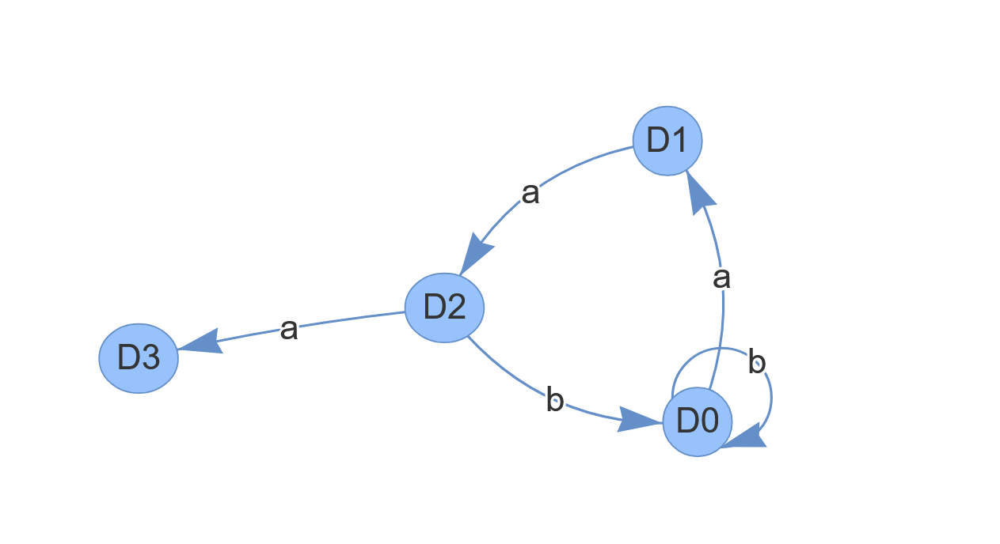

# Laboratory Work 2, Determinism in Finite Automata. Conversion from NDFA 2 DFA. Chomsky Hierarchy.

### Course: Formal Languages & Finite Automata
### Author: Brînză Vasile
### Group: FAF-242

----

## Theory

---

A finite automaton is a mechanism used to represent processes of different kinds. It can be compared to a state machine as they both have similar structures and purpose as well. The word finite signifies the fact that an automaton comes with a starting and a set of final states. In other words, for process modeled by an automaton has a beginning and an ending.

Based on the structure of an automaton, there are cases in which with one transition multiple states can be reached which causes non determinism to appear. In general, when talking about systems theory the word determinism characterizes how predictable a system is. If there are random variables involved, the system becomes stochastic or non deterministic.

That being said, the automata can be classified as non-/deterministic, and there is in fact a possibility to reach determinism by following algorithms which modify the structure of the automaton.

## Objectives

- Learn what an automaton is and its uses.

- Extend the existing project by adding a function in the grammar class to classify grammars according to the Chomsky hierarchy.

- Using the assigned variant:
  - Convert the finite automaton (FA) into a regular grammar.
  - Check if the FA is deterministic or non-deterministic. 
  - Implement a way to turn a non-deterministic FA (NDFA) into a deterministic FA (DFA).

Bonus:
- Represent the FA graphically using a library or tool by generating a visual diagram.


## Implementation description

---

### Grammar Class

`classifyGrammar`

```java
public String classifyGrammar() {
        boolean isRegular = true;
        boolean isContextFree = true;
        // assume grammar is regular / context-free

        for (String left : productions.keySet()) {
            // type 2 and 3 must have exactly one non-terminal on LHS
            if (left.length() != 1 || !VN.contains(left)) {
                isRegular = false;
                isContextFree = false;
                break;
            }

            List<String> rights = productions.get(left);
            for (String right : rights) {
                // when right-hand side has more than 2 symbols, cannot be regular
                if (right.length() > 2) {
                    isRegular = false;
                }

                // right-hand side shorter than LHS, cannot be context-sensitive
                if (right.length() < left.length()) {
                    return "Type 0 (Unrestricted)";
                }
            }
        }

        if (isRegular) return "Type 3 (Regular)";
        if (isContextFree) return "Type 2 (Context-Free)";
        return "Type 1 (Context-Sensitive)";
    }
```

The classifyGrammar() method in the Grammar class determines the type of the grammar according to the Chomsky hierarchy.

This method starts by assuming the grammar is both regular and context-free. It then checks each production rule. If the left-hand side is not a single non-terminal, the grammar cannot be context-free or regular. If any right-hand side has more than two symbols, the grammar is no longer regular. If a production reduces the length of the string, it is classified as unrestricted (Type 0).
Based on these checks, the method returns the most restrictive valid type.


### FiniteAutomata Class

`toRegularGrammar` 
```java
    public Grammar toRegularGrammar() {
    Set<String> VN = new HashSet<>(states);

    Set<String> VT = new HashSet<>();
    for (String symbol : alphabet) {
        VT.add(symbol);
    }

    Map<String, List<String>> productions = new HashMap<>();

    for (String state : states) {
        List<String> rules = new ArrayList<>();
        Map<Character, Set<String>> trans = transitions.get(state);

        for (Character symbol : trans.keySet()) {
            Set<String> targets = trans.get(symbol);
            for (String target : targets) {
                // when the target is final, add terminal-only production
                if (finalStates.contains(target)) {
                    rules.add(symbol.toString());
                }
                rules.add(symbol + target);
            }
        }

        if (!rules.isEmpty()) {
            productions.put(state, rules);
        }
    }

    return new Grammar(VN, VT, productions, startState);
}
```

I implemented a method in the `FiniteAutomation` class to convert an FA into a regular grammar. Each FA state becomes a non-terminal in the grammar, and each transition produces a corresponding production rule. If a transition leads to a final state, a terminal-only production is added. Multiple transitions per symbol are handled for non-deterministic automata.

`isDeterministic`
```java
    public boolean isDeterministic() {
        for (String state : transitions.keySet()) {
            Map<Character, Set<String>> trans = transitions.get(state);
            for (char symbol : trans.keySet()) {
                Set<String> targets = trans.get(symbol);
                // more than one target means non-deterministic
                if (targets.size() > 1) {
                    return false;
                }
            }
        }
        return true;
    }
```

I implemented isDeterministic() which iterates through all transitions and checks if any state-symbol pair has more than one target. If so, the automaton is non-deterministic.

### Bonus

`plot.py`

```python
import json
from pyvis.network import Network

def plot_dfa_from_json(filename):
    with open(filename) as f:
        data = json.load(f)

    transitions = data["transitions"]
    final_states = set(data["final_states"])

    graph = Network(height="600px", width="100%", notebook=True, directed=True)

    for state, trans in transitions.items():
        shape = "doublecircle" if state in final_states else "circle"
        graph.add_node(state, label=state, shape=shape)

        for symbol, next_states in trans.items():
            for next_state in next_states:
                shape_next = "doublecircle" if next_state in final_states else "circle"
                graph.add_node(next_state, label=next_state, shape=shape_next)
                graph.add_edge(state, next_state, label=symbol)

    graph.show("dfa_graph.html")

if __name__ == "__main__":
    plot_dfa_from_json("out.json")
```

The DFA transitions and final state were exported to a json -- `out.json` then plotted with Python using PyVis. 

The Python script reads the JSON, creates a graph with nodes as states and edges as transitions, and highlights final states with double circles.

### Output

<div> 
  
  <p>Figure 1 - Graphical representation of DFA</p>
</div>

## Conclusions

<div> 
  
  <p>Figure 2 - Output of program</p>
</div>

In this lab, I implemented the main operations related to finite automata and grammars. I converted a finite automaton into a regular grammar, checked whether the automaton is deterministic, and implemented the conversion from NDFA to DFA using subset construction.

I also added a method to classify grammars based on the Chomsky hierarchy, which helped better understand the differences between grammar types.

Overall, the lab helped me understand how automata and grammars are connected and how non-determinism can be transformed into deterministic behavior.

